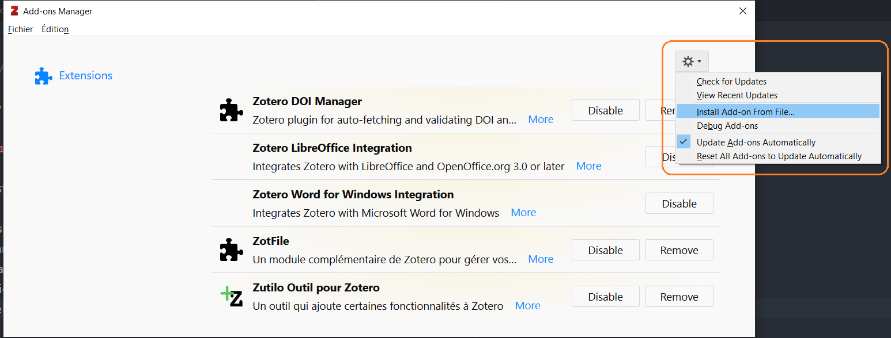
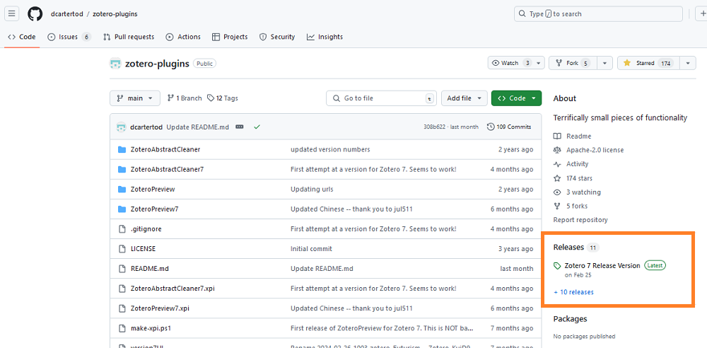
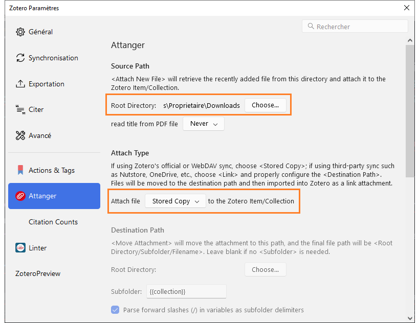
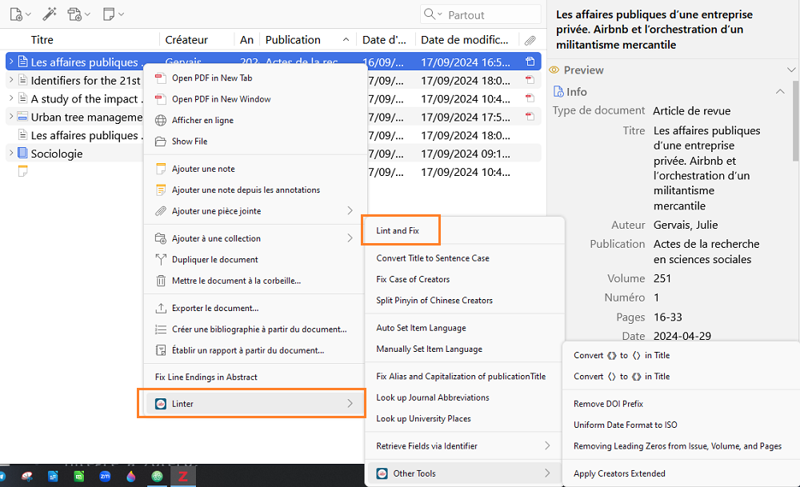
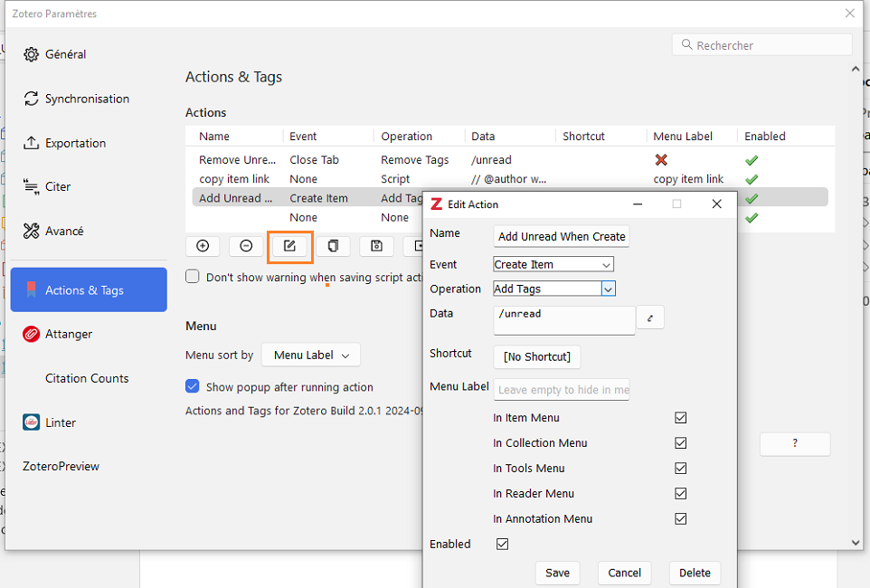

# Approfondissement Zotero : les extensions de Zotero

L'icône ![zotero][zotero] signale la documentation officielle Zotero, y compris les discussions du forum Zotero : c'est la meilleure source d'information et d'aide!

## Objectifs

* Utiliser des extensions pour optimiser l’usage courant de sa bibliothèque Zotero : modifications des données bibliographiques, gestion des marqueurs, organisation de la bibliothèque, etc.
* Identifier, installer et utiliser d'autres extensions de Zotero en fonction de ses besoins - ![zotero][zotero] [liste complète des extensions de Zotero](https://www.zotero.org/support/plugins)

## Sommaire

- [0. Tour de table](#0-tour-de-table)   
- [1. Installer et configurer une extension](#1-installer-et-configurer-une-extension)   
- [2. Optimiser la gestion des PDF avec Attanger](#2-optimiser-la-gestion-des-pdf-avec-attanger)  
- [3. Améliorer les données bibliographiques avec Zutilo et Linter](#4-améliorer-les-données-bibliographiques-avec-zutilo-et-linter)
- [4. Optimiser l'organisation de sa bibliothèque avec Actions and Tags](#3-optimiser-lorganisation-de-sa-bibliothèque-avec-actions-and-tags)  
- [5. A vous de tester une ou plusieurs extensions](#6-a-vous-de-tester-une-ou-plusieurs-extensions)

## 0. Tour de table

1. A quelle université ou organisation appartenez-vous? Quel est votre domaine de recherche?
2. Quelles sont vos attentes pour le stage?

## 1. Installer et configurer une extension

L’installation d’une extension dans Zotero consiste à charger dans Zotero un fichier d’un format particulier, le format `.xpi`. Voici les étapes à suivre.

* Enregistrer sur son ordinateur le fichier `.xpi` mis à disposition sur le site de l'extension que l’on souhaite installer.
* Dans Zotero, aller dans le menu _Outils_ > _Extensions_.
* Cliquer sur la roue dentée et choisir _Install Plugin From File_.
* Sélectionner et charger le fichier `.xpi`.

Il faut parfois redémarrer Zotero pour finaliser l’installation.

### Où trouver le fichier d'installation d'une extension?

Les extensions sont généralement distribuées par le biais d'un dépôt Git en ligne.

Sur GitHub, on trouve le plus souvent le fichier d'installation `.xpi` sur la page _Releases_, accessible depuis la page principale du dépôt comme illustré ci-dessous. Une fois sur cette page, il convient de choisir la version la plus adaptée, en général il s'agit de la dernière.

🛠️ Téléchargez et installez les extensions que nous allons voir au cours de la formation.

* [Attanger](https://github.com/MuiseDestiny/zotero-attanger)
* [Zutilo](https://github.com/wshanks/Zutilo)
* [Linter](https://github.com/northword/zotero-format-metadata)
* [Actions & Tags](https://github.com/windingwind/zotero-actions-tags)

## 2. Optimiser la gestion des PDF avec Attanger

L'extension ZotFile permettait jusqu'à Zotero 6 d'améliorer la gestion des fichiers joints grâce à ses fonctionnalités de **renommage** et de **déplacement** automatiques des fichiers.

Avec Zotero 7, Zotero dispose désormais d'une fonctionnalité de renommage des fichiers complète et sophistiquée.

![zotero][zotero] [Documentation Zotero : Renommage des fichiers](https://docs.zotero-fr.org/file_renaming/).

_Attanger_ reprend quant à lui fonctionnalités de **déplacement des fichiers** avec 2 cas d'usage :

1. déplacer automatiquement les fichiers joints dans un répertoire défini **hors de Zotero** si on choisit de gérer ces fichiers en dehors de Zotero,
2. attacher automatiquement au document en cours de sélection dans la bibliothèque Zotero le dernier fichier PDF téléchargé dans un répertoire défini.

### Comment gérez-vous vos PDF actuellement?

🗳️ Comment gérez-vous les PDF et autres fichiers joints aux documents de votre bibliothèque Zotero ?

1. Ces fichiers sont enregistrés **dans** le répertoire `Zotero\storage`, automatiquement par Zotero ou par un ajout manuel de ma part grâce à la fonction _Ajouter une pièce jointe_>_Joindre une copie enregistrée d'un fichier_.
2. Ces fichiers sont enregistrés **en dehors** du répertoire `Zotero\storage`et ne sont pas liés aux documents Zotero.
3. Ces fichiers sont enregistrés **en dehors** du répertoire `Zotero\storage`et je les lie aux documents Zotero grâce à la fonction _Ajouter une pièce jointe_>_Joindre un lien vers un fichier_.
4. Je ne comprends pas la question et/ou les options de réponse.

#### Ressources

Billet du blog Zotero francophone : [ZotFile : un outil pour gérer vos PDF](https://zotero.hypotheses.org/2838)

Et son supplément : Être ou ne pas être dans Zotero : quel choix pour vos PDF et autres fichiers joints ? - [schéma au format .odg](https://github.com/zfrancophone/zfrancophone-blog/blob/master/2019-09-zotfile/zotero_choix_gestion_fichiers.odg) et [schéma au format .pdf](https://github.com/zfrancophone/zfrancophone-blog/blob/master/2019-09-zotfile/zotero_choix_gestion_fichiers.pdf)

### Joindre automatiquement le dernier fichier PDF téléchargé

Pour utiliser cette fonctionnalité, il convient d'effectuer les 2 réglages suivants dans les paramètres d'_Attanger_.

* _Source Path_ : on indique ici le répertoire source à partir duquel chercher les fichiers PDF à joindre automatiquement. Cela peut être par exemple le dossier _Téléchargements_.
* _Attach Type_ : on choisit la valeur _Stored Copy_ si on enregistre ses fichiers joints dans Zotero.

Une fois sélectionné dans la bibliothèque Zotero le document auquel on souhaite joindre le dernier fichier PDF téléchargé dans le dossier source, il suffit de cliquer sur l'option _Attach New File_ du menu contextuel.

## 3. Améliorer les données bibliographiques avec Zutilo et Linter
### Zutilo

Par le biais d'options de menu supplémentaires et de raccourcis clavier, Zutilo ajoute des fonctions non disponibles en standard dans Zotero. Voici quelques-unes des fonctionnalités de Zutilo.

* Copier, coller et retirer des ensembles de marqueurs.
* Créer des liens de "Connexe" entre les documents sélectionnés grâce à un clic-droit avec le bouton de la souris.
* Copier dans le presse-papiers des documents dans plusieurs formats différents.
* Modifier des documents, définir l'emplacement du curseur et masquer différents éléments de l'interface utilisateur Zotero grâce à des raccourcis clavier.

Zutilo s'efforce de réaliser tous vos souhaits en termes de flux de travail Zotero, et de rester à l'écart autrement. Tous les éléments graphiques de Zutilo peuvent être désactivés individuellement, de sorte que les fonctionnalités indésirables n'encombrent pas l'interface utilisateur.

⚠️ Zutilo est maintenu principalement par une seule personne, qui ne dispose plus de beaucoup de temps pour Zutilo. De fait la compatibilité avec Zotero 7 est assurée seulement depuis début 2025, et quelques fonctionnalités (la configuration des raccourcis clavier notamment) ne fonctionnent plus. 

_Traduit de la [présentation de Zutilo - fichier README](https://github.com/wshanks/Zutilo/blob/master/README.md)_

La traduction en français de la documentation est disponible dans le dépôt GitHub de Zutilo.

* Le [fichier COMMANDS-fr](https://github.com/wshanks/Zutilo/blob/master/i18n/fr/readme/docs/COMMANDS.md) explicite chacune des fonctionnalités offertes par ZotFile.
* Le [fichier USAGE-fr](https://github.com/wshanks/Zutilo/blob/master/i18n/fr/readme/docs/USAGE.md) détaille des cas d'usage pour certaines fonctionnalités en particulier.

🛠️ Ouvrez les préférences de Zutilo et le fichier COMMANDS-fr.

📃 En considérant les fonctions **autres que les fonctions des pièces jointes**, notez :

* les **3** fonctionnalités de Zutilo qui vous semblent **les plus utiles**, en faisant précéder cette liste de `+1`,
* les **3** fonctionnalités de Zutilo que **vous ne comprenez pas** et pour lesquelles vous souhaiteriez une démo, en faisant précéder cette liste de `??`.

🕰️ Rendez-vous dans **10 minutes**.

<!-- Exemple1 : Copier + Coller dans les champs vides : Compléter des notices -> chapitres, chapitres 1 et 2 de Santé mondiale. Enjeu stratégique et jeux diplomatiques
Exemple2 : Copier + Remplacer les champs : Rendre conformes des notices -> articles revue d'éco. ind.
Exemple3 : Multiples formats pour copie rapide
Préférences avancées à modifier :
`extensions.zutilo.copyItems_alt_total`  -> nbre de alt souhaités
  Les documents seront copiés dans le presse-papiers en utilisant d'autres convertisseurs d'export.
  Pour sélectionner les convertisseurs utilisés par ces fonctions, les préférences correspondantes `extensions.zutilo.quickcopy_alt1` -> préciser le format
  `extensions.zutilo.quickcopy_alt2` -> préciser le format
  `export.quickCopy.setting` -> afficher la chaîne de caractères du format de sortie en cours de sélection-->

Notez que les 2 fonctionnalités suivantes sont désormais intégrées à Zotero, sous des intitulés différents, mais avec un fonctionnement similaire.

* Créer une notice "Chapitre de livre" - _fonctionnalité Zotero correspondante : Créer un Chapitre de livre_
* Créer une notice "Livre" - _fonctionnalité Zotero correspondante : Créer un Livre à partir du Chapitre de livre_

### Linter pour déboulocher vos références

A l'instar des bouloches qui témoignent de l'usure d'un vêtement, les multiples petites imperfections que _Linter_ corrige viennent ternir l'aspect de votre bibliothèque Zotero.

Les corrections effectuées par _Linter_ peuvent être lancées sur une sélection de documents via le menu contextuel _Linter_ :

* soit de façon distincte et sélective,
* soit toutes en même temps d'un seul coup avec la commande _Lint and Fix_. Cette commande peut par ailleurs s'exécuter automatiquement à l'enregistrement d'un nouveau document.

📌 Ces corrections peuvent être configurées et/ou désactivées de la commande _Lint and Fix_ dans les paramètres de _Linter_.

Parmi les multiples fonctionnalités de _Linter_, nous retenons celles que nous avons pu tester avec succès et qui nous semblent de l'usage le plus courant.

#### Corriger la casse des titres, des titres de revues et des auteurs

Zotero 7 intègre désormais certaines de ces corrections, mais _Linter_ apporte diverses améliorations.

* Pour les **auteurs**, la fonctionnalité manuelle de Zotero peut être rendue automatique.
* Pour les **titres**, _Linter_ ajoute à la fonctionnalité de Zotero de conversion automatique de la casse de titre vers la casse de phrase la prise en compte de certains noms propres (notamment les formules chimiques).
* Pour les **titres de revues**, il s'agit d'appliquer la casse de titre.

⚠️ Il n'est pas d'usage d'utiliser la casse de titre pour les titres de revues françaises, aussi il est plus prudent d'exclure cette option de la commande _Lint and Fix_ si vous citez beaucoup d'articles de revues françaises.   

#### Corriger les abréviations de revue

_Linter_ peut compléter et/ou corriger le champ "Abrév. de revue" automatiquement, en fonction de l'une des options suivantes.

* L'abréviation doit être présente et conforme à [la norme ISO4](https://fr.wikipedia.org/wiki/ISO_4).
* L'abréviation doit correspondre à celle présente **dans une liste personnalisée** que vous devez alors charger dans l'application (fonctionnalité non testée par nos soins).
* L'abréviation est déduite du titre de la revue selon les règles d'abréviation standardisées internationales.

#### Normaliser les données de certains champs

* Appliquer pour les **dates** le format ISO YYYY-MM-DD.
* Supprimer le préfixe d'URL du champ **DOI**.
* Supprimer les 0 au début des numéros de volume, numéro et pages.

#### Raccourcis clavier pour l'italique, le gras, etc.

Si Zotero permet d'appliquer une mise en forme enrichie à une partie d'un champ, il demeure fastidieux de saisir manuellement les balises html correspondantes.

![zotero][zotero] [Documentation Zotero : Comment puis-je mettre en forme certains mots d'un titre: par ex. en italique, en exposant ou en indice ?](https://docs.zotero-fr.org/kb/rich_text_bibliography/)

Avec _Linter_, les raccourcis clavier courants (ceux de Microsoft Word par exemple) peuvent être utilisés. Une fois le texte sélectionné, les combinaisons suivantes produisent la mise en forme indiquée.

- Exposant : `Ctrl` + `Shift` + `+`
- Indice : `Ctrl` + `=`
- Gras : `Ctrl` + `B`
- Italique : `Ctrl` + `I`
- Pas de casse: `Ctrl` + `N` - Le paramètre `class="nocase"` empêche certains noms spéciaux de se voir attribués une initiale en majuscule comme le prévoit par défaut la casse de phrase de CSL.

⚠️ Il ne s'agit pas là d'une correction intégrée aux commandes _Lint_. Elle ne fait pas l'objet de réglages dans les paramètres de _Linter_.

## 4. Optimiser l'organisation de sa bibliothèque avec Actions and Tags

### Aperçu

_Actions & Tags_ vous permet d'optimiser votre organisation et votre flux de travail, en définissant des actions déclenchées automatiquement et/ou manuellement. Ces actions peuvent effectuer différentes opérations, notamment l'ajout et le retrait de marqueurs.

Vous pouvez également créer des scripts personnalisés, pour [remplacer un marqueur par un autre](https://github.com/windingwind/zotero-actions-tags/discussions/113) ou encore [générer automatiquement une note lors de l'ouverture d'un document](https://github.com/windingwind/zotero-actions-tags/discussions/108).

#### Exemple : les actions "à lire"

_Actions & Tags_ travaille déjà pour vous dès son installation.

Ainsi, le marqueur `/unread` est désormais automatiquement ajouté et retiré aux nouveaux documents de votre bibliothèque grâce à 2 actions paramétrées dans _Actions & Tags_.

Enregistrez un document (**avec ou sans fichier joint**) dans votre bibliothèque, avec le connecteur Zotero, la baguette magique ou encore un import de fichier. Le marqueur `/unread` lui est automatiquement ajouté.

Ouvrez **le fichier PDF joint** à ce document, lisez-le et refermez-le. Le marqueur `/unread` est automatiquement retiré du document.

### Créer des actions

_Actions & Tags_ s'adresse tant aux utilisateurs novices qu'aux utilisateurs experts, dotés de connaissances en codage informatique. Il permet en effet à la fois :

* de créer simplement et facilement des actions en combinant des options de menu déroulant et en saisissant quelques valeurs,
* de créer des scripts personnalisés en codant toutes les instructions.

#### Paramètres des actions

##### Libellés : _Name_ et _Menu Label_

Le libellé défini dans le champ _Name_ est utilisé uniquement dans la fenêtre de paramétrage.

Le libellé saisi dans _Menu Label_ s'affiche dans les menus contextuels dans lesquels vous choisissez de faire apparaître l'action. Dans le menu des annotations, l'option s'affiche directement. Dans les autres menus, elle apparaît derrière le menu ou le bouton _Trigger Action_. Si aucune valeur n'est saisie, l'action est masquée.

##### Evénement qui déclenche l'action : _Event_

Le tableau ci-dessous présente les différents événements qui peuvent être définis pour déclencher automatiquement l'opération à effectuer. Il s'agit d'événements simples et univoques tels que la création d'un document, d'une annotation et d'une note, ou encore du démarrage de Zotero.

Avec la valeur _None_, l'action est ne peut pas être déclenchée automatiquement. Elle doit être lancée manuellement.

Afficher les événements pris en charge

| Evénement              | Description : l'action est déclenchée  quand...        |
| ------------------ | --------------------------------------------------------- |
| `Create Item`       | Un document est créé.             |
| `Open File`         | Le fichier joint est ouvert.        |
| `Close Tab`         | L'onglet du lecteur de PDF est fermé.     |
| `Create Annotation` | Une annotation est créée.                  |
| `Create Note`       | Une note est créée.                         |
| `Append Annotation` | Une annotation est ajoutée au document cible.  |
| `Append Note`       | Une note est ajoutée au document cible.         |
| `Program Startup`   | Le client Zotero ou Actions & Tags démarre. |
| `Main Window Load`   | La fenêtre principale est chargée.                 |
| `Main Window Unload` | La fenêtre principale est refermée.      |

##### Opération effectuée par l'action : _Operation_

Les opérations prédéfinies concernent principalement les marqueurs.

Afficher les opérations prises en charge

| Opération      | Description                                                                    |
| -------------- | ------------------------------------------------------------------------------ |
| `Add Tags`      | Ajoute le marqueur(s) au document cible.                                        |
| `Remove Tags`   | Retire le marqueur(s) du document cible.                                      |
| `Toggle Tags`   | Bascule le marqueur(s) : le marqueur est ajouté si le document ne l'a pas et retiré dans le cas contraire.                                                                                  |
| `Script` | Exécute un script personnalisé.                                                |
| `Trigger Other Actions`  | Lance d'autres actions personnalisées.                                    |

##### Données de l'action : _Data_

Pour les opérations concernant les **marqueurs**, il s'agit des marqueurs séparés par des virgules.

Pour les **scripts personnalisés**, il s'agit du code du script.

Pour le **lancement d'autres actions**, il s'agit du nom des actions (une par ligne).

#### Créer une action simple

Nous allons maintenant créer une action personnalisée simple, c'est-à-dire en utilisant essentiellement les menus déroulants pour effectuer la configuration.

🕰️ Voici les indications pour créer cette action, vous disposez de **5 minutes** pour cela.

📝 On souhaite ajouter automatiquement au document un marqueur `_lu et annoté` quand une note fille est créée.

#### Utiliser un script personnalisé

Il existe déjà des scripts personnalisés, créés par des utilisateurs ou par le développeur de _Actions & Tags_. Ce dernier relit et valide tous les scripts, toutefois il recommande la prudence à l'égard de ces programmes, qui peuvent être puissants.

🕰️ Nous prenons **15 minutes** pour l'activité suivante.

📝 Nous allons installer le script personnalisé [Batch Tag Operations
](https://github.com/windingwind/zotero-actions-tags/discussions/351); choisissez les libellés et/ou le raccourci-clavier qui vous conviennent le mieux. 

📝 Parmi tous [les scripts personnalisés référencés](https://github.com/windingwind/zotero-actions-tags/discussions/categories/action-scripts), d'autres vous sembleraient-ils utiles? Lesquels?

## 5. A vous de tester une ou plusieurs extensions

🛠️ Nous allons maintenant tester d'autres extensions, selon les fonctionnalités supplémentaires que vous voudriez ajouter à Zotero.

Chacun d'entre vous va installer et tester l'extension de son choix.

Plusieurs personnes peuvent tester la même extension.

Vous rédigez en LaTeX ou avec un système qui utilise **BibTeX**? Si vous ne l'utilisez pas déjà testez [**BetterBibTeX**](https://retorque.re/zotero-better-bibtex/).

Vous souhaitez intégrer dans Zotero le **suivi des citations** des articles? Voici 2 extensions compatibles avec Zotero 7 pour cela.

* [Zotero 7 Citation Counts Manager](https://github.com/FrLars21/ZoteroCitationCountsManager)
* [Scite Zotero Plugin](https://github.com/scitedotai/scite-zotero-plugin)

Aucune idée?

Consultez ![zotero][zotero] [la liste complète des extensions de Zotero](https://www.zotero.org/support/plugins). Toutes les extensions présentées dans cette liste ne sont toutefois pas compatibles avec Zotero 7. 

Voici encore quelques suggestions supplémentaires.

* [**Zotero Abstract Cleaner**](https://github.com/dcartertod/zotero-plugins) pour nettoyer automatiquement les sauts de ligne dans les résumés copiés-collés depuis des fichiers PDF.
* [**Zotero PDF Translate**](https://github.com/windingwind/zotero-pdf-translate) pour traduire des extraits de PDF à partir du lecteur de PDF intégré à Zotero, traduire automatiquement le titre et le résumé d'un document sélectionné dans sa bibliothèque Zotero, etc.
* [**Zoplicate**](https://github.com/ChenglongMa/zoplicate) pour améliorer la gestion des doublons et par exemple les fusionner par lot.
* [**DOI Manager**]() pour vérifier, nettoyer et retrouver automatiquement les DOI des documents de votre bibliothèque. Cela améliore la qualité des données bibliographiques et peut rendre plus performants [les moteurs de recherche intégrés à Zotero](https://zotero.hypotheses.org/3388).

Toujours pas d'idée? Testez l'une des extensions choisies par un autre participant.

📃 Notez l'extension que vous allez tester.

🕰️ Rendez-vous dans **25 minutes** pour une mise en commun et un retour d'expérience de l'extension que vous avez testée.

🤔Si le test de l'extension que vous avez choisie initialement tourne court, changez d'extension, et signalez ce changement.

[zotero]: img/icone_zotero.png

# Crédits

 Ce document est mis à disposition selon les termes de la <a rel="license" href="http://creativecommons.org/licenses/by-sa/3.0/fr/">Licence Creative Commons Attribution -  Partage dans les Mêmes Conditions 3.0 France</a>.

**Auteur**

Frédérique Flamerie
