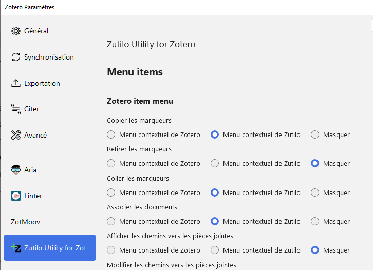
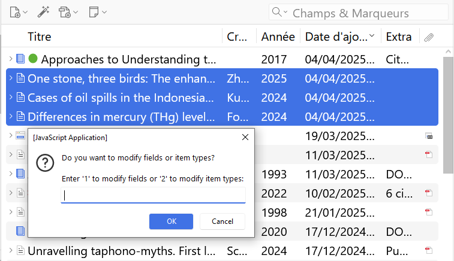

# Approfondissement Zotero : les extensions de Zotero

## Objectifs

* Utiliser des extensions pour optimiser l’usage courant de sa bibliothèque Zotero : modifications des données bibliographiques, gestion des marqueurs, organisation de la bibliothèque, etc.
* Identifier, installer et utiliser d'autres extensions de Zotero en fonction de ses besoins - ![zotero][zotero] [liste complète des extensions de Zotero](https://www.zotero.org/support/plugins)

## Sommaire

0. Tour de table   
1. Installer et configurer une extension 
2. Optimiser la gestion des PDF avec Attanger
3. Améliorer les données bibliographiques avec Zutilo et Linter
4. Optimiser l'organisation de sa bibliothèque avec Actions and Tags
5. A vous de tester une ou plusieurs extensions

## 0. Tour de table

1. A quelle université ou organisation appartenez-vous? Quel est votre domaine de recherche?
2. Quelles sont vos attentes pour le stage?

## 1. Installer et configurer une extension

La procédure est détaillée dans la base de connaissance en français de Zotero. 

![zotero][zotero] [KBFR Zotero : Les extensions de Zotero > Installer et configurer une extension](https://docs.zotero-fr.org/kbfr/kbfr_extensions/#installer-et-configurer-une-extension)

🛠️ Téléchargez et installez les extensions que nous allons voir au cours de la formation.

* [Attanger](https://github.com/MuiseDestiny/zotero-attanger)
* [Zutilo](https://github.com/wshanks/Zutilo)
* [Linter](https://github.com/northword/zotero-format-metadata)
* [Actions & Tags](https://github.com/windingwind/zotero-actions-tags)

💡 L'extension [Add-on Market for Zotero](https://github.com/syt2/zotero-addons) facilite à la fois le repérage, l'installation et la gestion des extensions. Elle permet notamment d'installer en un clic toutes les extensions qu'elle répertorie.

## 2. Optimiser la gestion des PDF avec Attanger

L'extension ZotFile permettait jusqu'à Zotero 6 d'améliorer la gestion des fichiers joints grâce à ses fonctionnalités de **renommage** et de **déplacement** automatiques des fichiers.

Avec Zotero 7, Zotero dispose désormais d'une fonctionnalité de renommage des fichiers complète et sophistiquée.

![zotero][zotero] [Documentation Zotero : Renommage des fichiers](https://docs.zotero-fr.org/file_renaming/).

2 nouvelles extensions, Attanger et ZotMoov, reprennent les fonctionnalités de **déplacement des fichiers**, avec 2 cas d'usage.

1. Déplacer automatiquement ou ponctuellement les fichiers attachés dans un dossier cible défini **hors de Zotero** si on choisit de gérer ces fichiers en dehors de Zotero, c'est-à-dire en tant que **fichiers liés**. Consultez [la documentation concernant la distinction entre fichiers joints et fichiers liés](https://docs.zotero-fr.org/attaching_files/#fichiers-joints-et-fichiers-lies) pour des informations détaillées à ce sujet.
2. Attacher au document en cours de sélection dans la bibliothèque Zotero le dernier fichier téléchargé dans un dossier source défini. Si ZotFile se limitait aux PDF pour cette fonctionnalité, Attanger et ZotMoov considèrent le dernier fichier téléchargé, **quel que soit le format de fichier**.

Ces deux extensions offrent des fonctionnalités analogues, mais présentent également chacune des spécificités. Attanger dispose ainsi de fonctionnalités liées au **renommage** des fichiers, et non ZotMoov.

![zotero][zotero] [KBFR Zotero : Extensions Attanger et ZotMoov](https://docs.zotero-fr.org/kbfr/kbfr_attanger_zotmoov/)

### Comment gérez-vous vos PDF actuellement?

🗳️ Comment gérez-vous les PDF et autres fichiers joints aux documents de votre bibliothèque Zotero ?

1. Ces fichiers sont enregistrés **dans** le répertoire `Zotero\storage`, automatiquement par Zotero ou par un ajout manuel de ma part grâce à la fonction _Ajouter une pièce jointe_>_Joindre une copie enregistrée d'un fichier_.
2. Ces fichiers sont enregistrés **en dehors** du répertoire `Zotero\storage`et ne sont pas liés aux documents Zotero.
3. Ces fichiers sont enregistrés **en dehors** du répertoire `Zotero\storage`et je les lie aux documents Zotero grâce à la fonction _Ajouter une pièce jointe_>_Joindre un lien vers un fichier_.
4. Je ne comprends pas la question et/ou les options de réponse.

## 3. Améliorer les données bibliographiques avec Zutilo et Linter

### Zutilo 

Par le biais d'options de menu supplémentaires, Zutilo ajoute des fonctions à Zotero ou simplifie l'usage de fonctions existantes. Voici quelques-unes des fonctionnalités de Zutilo.

* Copier, coller et retirer des ensembles de marqueurs.
* Créer des liens de "Connexe" entre les documents sélectionnés grâce à un clic-droit avec le bouton de la souris.
* Copier et coller les auteurs.

⚠️ Zutilo est maintenu principalement par une seule personne, qui ne dispose plus de beaucoup de temps pour Zutilo. De fait la compatibilité avec Zotero 7 est assurée seulement depuis début 2025, et quelques fonctionnalités (la configuration des raccourcis clavier notamment) ne fonctionnent plus. 

La traduction en français de la documentation est disponible dans le dépôt GitHub de Zutilo.

* Le [fichier COMMANDS-fr](https://github.com/wshanks/Zutilo/blob/master/i18n/fr/readme/docs/COMMANDS.md) explicite chacune des fonctionnalités offertes par Zutilo.
* Le [fichier USAGE-fr](https://github.com/wshanks/Zutilo/blob/master/i18n/fr/readme/docs/USAGE.md) détaille des cas d'usage pour certaines fonctionnalités en particulier.

🛠️ Ouvrez les préférences de Zutilo et le fichier COMMANDS-fr.

📃 En considérant les fonctions **autres que les fonctions des pièces jointes**, notez :

* les **3** fonctionnalités de Zutilo qui vous semblent **les plus utiles**, en faisant précéder cette liste de `+1`,
* les **3** fonctionnalités de Zutilo que **vous ne comprenez pas** et pour lesquelles vous souhaiteriez une démo, en faisant précéder cette liste de `??`.

<!-- Exemple1 : Copier + Coller dans les champs vides : Compléter des notices -> chapitres, chapitres 1 et 2 de Santé mondiale. Enjeu stratégique et jeux diplomatiques
Exemple2 : Copier + Remplacer les champs : Rendre conformes des notices -> articles revue d'éco. ind.
Exemple3 : Multiples formats pour copie rapide
Préférences avancées à modifier :
`extensions.zutilo.copyItems_alt_total`  -> nbre de alt souhaités
  Les documents seront copiés dans le presse-papiers en utilisant d'autres convertisseurs d'export.
  Pour sélectionner les convertisseurs utilisés par ces fonctions, les préférences correspondantes `extensions.zutilo.quickcopy_alt1` -> préciser le format
  `extensions.zutilo.quickcopy_alt2` -> préciser le format
  `export.quickCopy.setting` -> afficher la chaîne de caractères du format de sortie en cours de sélection-->

Notez que les 2 fonctionnalités suivantes sont désormais intégrées à Zotero, sous des intitulés différents, mais avec un fonctionnement similaire.

* Créer une notice "Chapitre de livre" - _fonctionnalité Zotero correspondante : Créer un Chapitre de livre_
* Créer une notice "Livre" - _fonctionnalité Zotero correspondante : Créer un Livre à partir du Chapitre de livre_

### Linter pour déboulocher vos références

A l'instar des bouloches qui témoignent de l'usure d'un vêtement, les multiples petites imperfections que Linter corrige viennent ternir l'aspect de votre bibliothèque Zotero.

![zotero][zotero] [KBFR Zotero : Extension Linter](https://docs.zotero-fr.org/kbfr/kbfr_linter/)

## 4. Optimiser l'organisation de sa bibliothèque avec Actions and Tags

Actions & Tags vous permet d'optimiser votre organisation et votre flux de travail, en définissant des actions déclenchées automatiquement et/ou manuellement. 

![zotero][zotero] [KBFR Zotero : Extension Actions & Tags](https://docs.zotero-fr.org/kbfr/kbfr_actions_tags/)

### Créer une action simple

📝 Nous allons créer une action personnalisée simple, c'est-à-dire en utilisant essentiellement les menus déroulants pour effectuer la configuration.

👉 On souhaite ajouter automatiquement au document un marqueur `_lu et annoté` quand une note fille est créée.

### Utiliser un script personnalisé 

📝 Installons ensemble le script personnalisé [Bulk Edit Multiple Items](https://github.com/windingwind/zotero-actions-tags/discussions/343). 

## 5. A vous de tester une ou plusieurs extensions

🛠️ Nous allons maintenant tester d'autres extensions, selon les fonctionnalités supplémentaires que vous voudriez ajouter à Zotero.

Chacun d'entre vous va installer et tester l'extension de son choix.

Plusieurs personnes peuvent tester la même extension.

Vous rédigez en LaTeX ou avec un système qui utilise **BibTeX**? Si vous ne l'utilisez pas déjà, testez [**BetterBibTeX**](https://retorque.re/zotero-better-bibtex/).

Vous souhaitez intégrer dans Zotero le **suivi des citations** des articles? Voici 2 extensions compatibles avec Zotero 7 pour cela.

* [Zotero 7 Citation Counts Manager](https://github.com/FrLars21/ZoteroCitationCountsManager)
* [Scite Zotero Plugin](https://github.com/scitedotai/scite-zotero-plugin)

Aucune idée?

Consultez la rubrique [KBFR Zotero : Les extensions de Zotero > Trouver une extension](https://docs.zotero-fr.org/kbfr/kbfr_extensions/#trouver-une-extension).

Voici encore quelques suggestions supplémentaires.

* [**Zotero PDF Translate**](https://github.com/windingwind/zotero-pdf-translate) pour traduire des extraits de PDF à partir du lecteur de PDF intégré à Zotero, traduire automatiquement les résumés, etc.
* [**Zoplicate**](https://github.com/ChenglongMa/zoplicate) pour améliorer la gestion des doublons et par exemple les fusionner par lot.
* [**DOI Manager**](https://github.com/bwiernik/zotero-shortdoi) pour vérifier, nettoyer et retrouver automatiquement les DOI des documents de votre bibliothèque. Cela améliore la qualité des données bibliographiques et peut rendre plus performants [les moteurs de recherche intégrés à Zotero](https://zotero.hypotheses.org/3388).

Toujours pas d'idée? Testez l'une des extensions choisies par un autre participant.

📃 Notez l'extension que vous allez tester.

🤔 Si le test de l'extension que vous avez choisie initialement tourne court, changez d'extension, et signalez ce changement.

[zotero]: img/icone_zotero.png

# Crédits

 Ce document est mis à disposition selon les termes de la <a rel="license" href="http://creativecommons.org/licenses/by-sa/3.0/fr/">Licence Creative Commons Attribution -  Partage dans les Mêmes Conditions 3.0 France</a>.

**Auteur**

Frédérique Flamerie
